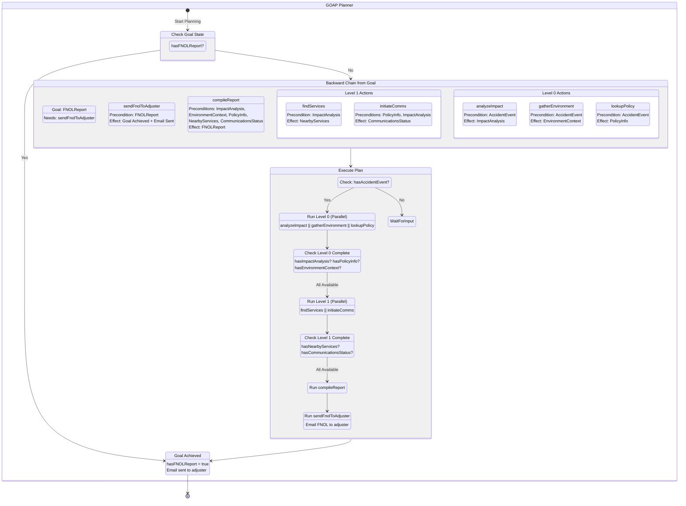
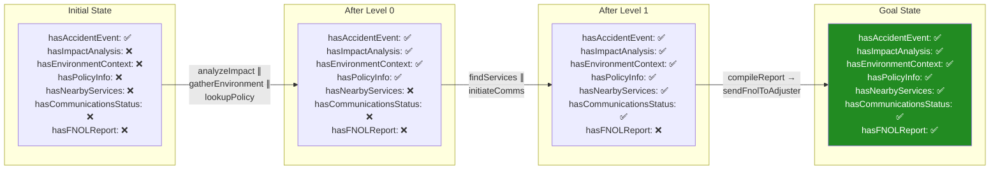
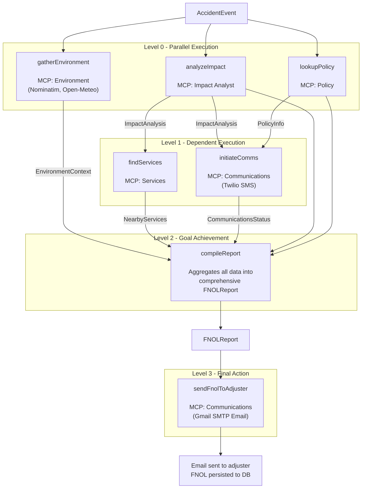
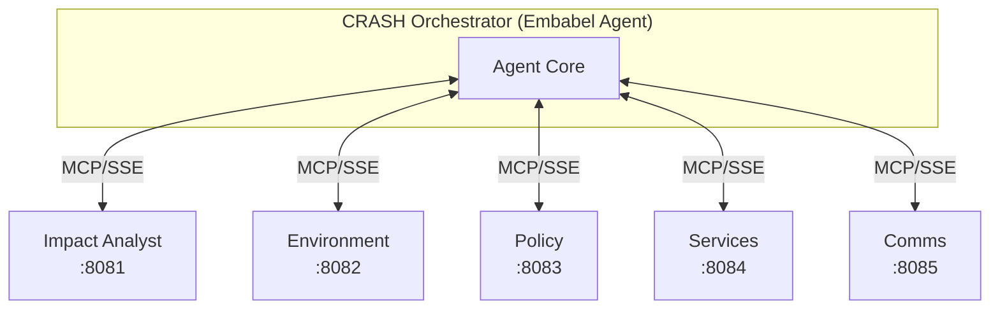
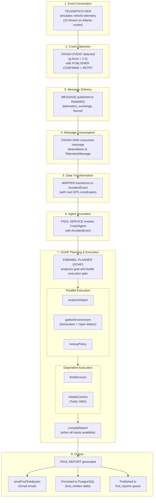

# Agentic Architecture: A Deep Dive

## Table of Contents
- [101: Foundations](#101-foundations)
  - [What is an Agent?](#what-is-an-agent)
  - [Agents vs Traditional Code](#agents-vs-traditional-code)
  - [Key Concepts](#key-concepts)
- [201: Implementation Patterns](#201-implementation-patterns)
  - [Goal-Oriented Action Planning (GOAP)](#goal-oriented-action-planning-goap)
  - [Type-Based Dependency Resolution](#type-based-dependency-resolution)
  - [LLM-Driven Tool Execution](#llm-driven-tool-execution)
  - [Multi-Agent Coordination](#multi-agent-coordination)
- [CRASH System Architecture](#crash-system-architecture)
  - [Component Overview](#component-overview)
  - [Execution Flow](#execution-flow)
  - [MCP (Model Context Protocol)](#mcp-model-context-protocol)

---

# 101: Foundations

## What is an Agent?

An **agent** is a software system that:
1. Has a **goal** it's trying to achieve
2. Has access to **tools/actions** it can use
3. Can **perceive** its environment and current state
4. Can **reason** about how to achieve its goal
5. Can **adapt** when things don't go as planned

Think of an agent like a skilled employee vs. a checklist:

| Checklist (Traditional Code) | Employee (Agent) |
|------------------------------|------------------|
| "Do step 1, then step 2, then step 3" | "Here's the goal - figure out how to achieve it" |
| Fails if any step fails | Can try alternative approaches |
| Fixed sequence | Dynamic execution based on conditions |
| Developer decides everything upfront | Agent decides based on current situation |

## Agents vs Traditional Code

### Traditional Procedural Approach

```java
// Developer explicitly codes every step and decision
public FNOLReport processAccident(AccidentEvent event) {
    // Step 1: Always runs first
    ImpactAnalysis impact = impactService.analyze(event);

    // Step 2: Always runs second
    EnvironmentContext env = envService.gather(event);

    // Step 3: Always runs third
    PolicyInfo policy = policyService.lookup(event);

    // Step 4: Must manually code dependency
    NearbyServices services = servicesService.find(event, impact);

    // Step 5: Must manually code all dependencies
    CommunicationsStatus comms = commsService.send(event, policy, impact);

    // Step 6: Compile everything
    return compileReport(event, impact, env, policy, services, comms);
}
```

**Problems with this approach:**
- Order is hard-coded (steps 2 and 3 could run in parallel, but don't)
- No automatic fallbacks if a step fails
- Adding a new step requires understanding the entire flow
- Dependencies are implicit in the code order, not explicit

### Agentic Approach

```java
@Agent(description = "FNOL Agent - Processes accidents into claim reports")
public class CrashAgent {

    @Action(description = "Analyze impact severity")
    public ImpactAnalysis analyzeImpact(AccidentEvent event, Ai ai) {
        // I produce ImpactAnalysis, I need AccidentEvent
    }

    @Action(description = "Gather environmental context")
    public EnvironmentContext gatherEnvironment(AccidentEvent event, Ai ai) {
        // I produce EnvironmentContext, I need AccidentEvent
    }

    @Action(description = "Look up policy information")
    public PolicyInfo lookupPolicy(AccidentEvent event, Ai ai) {
        // I produce PolicyInfo, I need AccidentEvent
    }

    @Action(description = "Find nearby services")
    public NearbyServices findServices(AccidentEvent event, ImpactAnalysis impact, Ai ai) {
        // I produce NearbyServices, I need AccidentEvent AND ImpactAnalysis
    }

    @Action(description = "Initiate communications")
    public CommunicationsStatus initiateComms(AccidentEvent event, PolicyInfo policy,
                                               ImpactAnalysis impact, Ai ai) {
        // I produce CommunicationsStatus, I need AccidentEvent, PolicyInfo, AND ImpactAnalysis
    }

    @AchievesGoal(description = "Generate complete FNOL report")
    @Action(description = "Compile final report")
    public FNOLReport compileReport(AccidentEvent event, ImpactAnalysis impact,
                                     EnvironmentContext environment, PolicyInfo policy,
                                     NearbyServices services, CommunicationsStatus communications) {
        // I achieve the GOAL, I need EVERYTHING
    }
}
```

**What the framework does automatically:**
- Analyzes method signatures to understand dependencies
- Builds an execution plan that maximizes parallelism
- Handles failures and can try alternative actions
- The developer declares *what's possible*, the framework decides *how to execute*

## Key Concepts

### 1. Goals
A **goal** is the desired end state. In CRASH, the goal is generating an `FNOLReport`.

```java
@AchievesGoal(description = "Generate complete FNOL report")
public FNOLReport compileReport(...) { }
```

The `@AchievesGoal` annotation tells the framework: "When this action completes successfully, we've achieved what we set out to do."

### 2. Actions
**Actions** are the capabilities the agent has. Each action:
- Has a **description** (for the LLM to understand what it does)
- Takes **inputs** (parameters it needs)
- Produces an **output** (its return type)

```java
@Action(description = "Analyze accident telemetry to determine severity")
public ImpactAnalysis analyzeImpact(AccidentEvent event, Ai ai) { }
```

### 3. State
**State** is the collection of all data available at any point. As actions complete, they add to the state:

```
Initial State: { AccidentEvent }
After analyzeImpact: { AccidentEvent, ImpactAnalysis }
After gatherEnvironment: { AccidentEvent, ImpactAnalysis, EnvironmentContext }
...and so on
```

### 4. Planning
**Planning** is how the agent decides which actions to take and in what order. The planner:
1. Looks at the goal
2. Works backward to find what actions can achieve it
3. Recursively finds what's needed for those actions
4. Builds an execution graph

### 5. Tools
**Tools** are external capabilities the agent can invoke. In CRASH, each MCP server provides tools:
- Impact Analyst: `analyze_impact`, `classify_severity`
- Environment: `get_weather`, `reverse_geocode`, `get_road_conditions`
- Policy: `lookup_policy`, `get_driver_info`, `get_coverage_details`
- etc.

---

# 201: Implementation Patterns

## Goal-Oriented Action Planning (GOAP)

GOAP is an AI planning technique originally developed for video game AI. It works by:

### 1. Defining the World State
The world state is a set of facts that are true at any moment:

```
WorldState = {
    hasAccidentEvent: true,
    hasImpactAnalysis: false,
    hasEnvironmentContext: false,
    hasPolicyInfo: false,
    hasNearbyServices: false,
    hasCommunicationsStatus: false,
    hasFNOLReport: false
}
```

### 2. Defining Actions with Preconditions and Effects

Each action has:
- **Preconditions**: What must be true before the action can run
- **Effects**: What becomes true after the action runs

```
Action: analyzeImpact
  Preconditions: { hasAccidentEvent: true }
  Effects: { hasImpactAnalysis: true }

Action: findServices
  Preconditions: { hasAccidentEvent: true, hasImpactAnalysis: true }
  Effects: { hasNearbyServices: true }

Action: compileReport
  Preconditions: { hasAccidentEvent: true, hasImpactAnalysis: true,
                   hasEnvironmentContext: true, hasPolicyInfo: true,
                   hasNearbyServices: true, hasCommunicationsStatus: true }
  Effects: { hasFNOLReport: true }
```

### 3. Backward Chaining to Build a Plan

Starting from the goal (`hasFNOLReport: true`), the planner works backward:

```
Goal: hasFNOLReport = true
  └── Requires: compileReport
      └── Preconditions: hasImpactAnalysis, hasEnvironmentContext, hasPolicyInfo,
                         hasNearbyServices, hasCommunicationsStatus
          ├── hasImpactAnalysis → analyzeImpact (needs: hasAccidentEvent ✓)
          ├── hasEnvironmentContext → gatherEnvironment (needs: hasAccidentEvent ✓)
          ├── hasPolicyInfo → lookupPolicy (needs: hasAccidentEvent ✓)
          ├── hasNearbyServices → findServices (needs: hasAccidentEvent ✓, hasImpactAnalysis)
          └── hasCommunicationsStatus → initiateComms (needs: hasAccidentEvent ✓,
                                                        hasPolicyInfo, hasImpactAnalysis)
```

### 4. Identifying Parallelism

Actions that share NO dependencies on each other can run in parallel:

```
Level 0 (can run immediately):
  - analyzeImpact (needs only AccidentEvent)
  - gatherEnvironment (needs only AccidentEvent)
  - lookupPolicy (needs only AccidentEvent)

Level 1 (needs Level 0 results):
  - findServices (needs ImpactAnalysis from Level 0)
  - initiateComms (needs ImpactAnalysis AND PolicyInfo from Level 0)

Level 2 (needs everything):
  - compileReport
```

### GOAP Decision Making Diagram

This diagram shows how the GOAP planner makes decisions based on current world state:



### World State Transitions



### Action Preconditions & Effects

```mermaid
flowchart TB
    subgraph Actions["GOAP Action Registry"]
        direction TB

        subgraph A1["analyzeImpact"]
            A1P["PRE: AccidentEvent"]
            A1E["EFF: ImpactAnalysis"]
            A1P --> A1E
        end

        subgraph A2["gatherEnvironment"]
            A2P["PRE: AccidentEvent"]
            A2E["EFF: EnvironmentContext"]
            A2P --> A2E
        end

        subgraph A3["lookupPolicy"]
            A3P["PRE: AccidentEvent"]
            A3E["EFF: PolicyInfo"]
            A3P --> A3E
        end

        subgraph A4["findServices"]
            A4P["PRE: AccidentEvent +<br/>ImpactAnalysis"]
            A4E["EFF: NearbyServices"]
            A4P --> A4E
        end

        subgraph A5["initiateComms"]
            A5P["PRE: AccidentEvent +<br/>PolicyInfo + ImpactAnalysis"]
            A5E["EFF: CommunicationsStatus"]
            A5P --> A5E
        end

        subgraph A6["compileReport"]
            A6P["PRE: All of above"]
            A6E["EFF: FNOLReport"]
            A6P --> A6E
        end

        subgraph A7["sendFnolToAdjuster"]
            A7P["PRE: FNOLReport"]
            A7E["EFF: GOAL ✅"]
            A7P --> A7E
        end
    end

    subgraph Legend["Legend"]
        LP["PRE = Preconditions<br/>(what must exist)"]
        LE["EFF = Effects<br/>(what gets produced)"]
    end

    style A7E fill:#228B22,color:#fff
```



### Visual Execution Graph



### Data Flow Summary

| Level | Actions | Dependencies | MCP Tools Used |
|-------|---------|--------------|----------------|
| 0 | analyzeImpact, gatherEnvironment, lookupPolicy | AccidentEvent only | analyze_impact, reverseGeocode, getWeather, lookupPolicy |
| 1 | findServices, initiateComms | ImpactAnalysis, PolicyInfo | findNearbyServices, sendSms, checkDriverWelfare |
| 2 | compileReport | All of the above | (local aggregation) |
| 3 | sendFnolToAdjuster | FNOLReport | notifyAdjuster (Gmail) |

## Type-Based Dependency Resolution

In the Embabel framework, dependencies are expressed through Java types (method parameters and return types).

### How the Framework Reads Method Signatures

```java
public NearbyServices findServices(AccidentEvent event, ImpactAnalysis impact, Ai ai)
//     └── PRODUCES                └── REQUIRES        └── REQUIRES    └── Framework-provided
```

The framework builds a registry:

```
TypeRegistry:
  AccidentEvent → [provided by caller]
  ImpactAnalysis → [produced by analyzeImpact]
  EnvironmentContext → [produced by gatherEnvironment]
  PolicyInfo → [produced by lookupPolicy]
  NearbyServices → [produced by findServices]
  CommunicationsStatus → [produced by initiateComms]
  FNOLReport → [produced by compileReport] ← GOAL
```

### Why This is Powerful

1. **Compile-Time Safety**: If you misspell a type, Java won't compile
2. **Self-Documenting**: The signature IS the documentation of dependencies
3. **Automatic Updates**: Add a new parameter, and the planner automatically accounts for it
4. **IDE Support**: Refactoring tools understand the relationships

### Adding a New Action

Want to add fraud detection? Just add a method:

```java
@Action(description = "Check for fraud indicators")
public FraudAssessment checkFraud(AccidentEvent event, ImpactAnalysis impact,
                                   PolicyInfo policy, Ai ai) {
    // Returns FraudAssessment
}
```

Now update compileReport to use it:

```java
@AchievesGoal
public FNOLReport compileReport(AccidentEvent event, ImpactAnalysis impact,
                                 EnvironmentContext environment, PolicyInfo policy,
                                 NearbyServices services, CommunicationsStatus communications,
                                 FraudAssessment fraud) {  // Added new parameter
    // Now includes fraud assessment
}
```

The planner automatically:
- Sees `compileReport` needs `FraudAssessment`
- Finds `checkFraud` produces `FraudAssessment`
- Sees `checkFraud` needs `ImpactAnalysis` and `PolicyInfo`
- Schedules `checkFraud` after those are available

**No changes to execution logic needed!**

## LLM-Driven Tool Execution

Each action doesn't just call a service directly - it uses an LLM to interpret and execute:

```java
@Action(description = "Analyze accident telemetry to determine severity")
public ImpactAnalysis analyzeImpact(AccidentEvent event, Ai ai) {
    return ai.withAutoLlm().createObject(
        """
        Use the Impact Analyst tools to analyze this accident.

        Call the analyze_impact tool with:
        - gForce: %f
        - speedMph: %f
        - speedLimitMph: %d
        - accelerometerX: %f
        - accelerometerY: %f
        - accelerometerZ: %f

        Return the complete ImpactAnalysis result.
        """.formatted(
            event.gForce(),
            event.speedMph(),
            event.speedLimitMph(),
            event.accelerometerX(),
            event.accelerometerY(),
            event.accelerometerZ()
        ),
        ImpactAnalysis.class
    );
}
```

### What Happens Inside `ai.withAutoLlm().createObject()`

1. **Tool Discovery**: The LLM sees what tools are available (from MCP servers)
2. **Instruction Parsing**: The LLM reads the natural language prompt
3. **Tool Selection**: The LLM decides which tool(s) to call
4. **Parameter Mapping**: The LLM formats the parameters correctly
5. **Execution**: The tool is called via MCP
6. **Result Parsing**: The response is mapped to the target class
7. **Error Handling**: If something fails, the LLM can retry or try alternatives

### Why Use an LLM for This?

**Flexibility**: The prompt can be imprecise, and the LLM figures it out:
```
"Use the weather tools to get conditions at this location"
// LLM figures out: call get_weather with lat/long
```

**Adaptation**: If the tool interface changes slightly, the LLM adapts:
```
// Old tool: get_weather(lat, long)
// New tool: get_weather(latitude, longitude, timestamp)
// LLM handles the mapping automatically
```

**Multi-Tool Orchestration**: The LLM can call multiple tools if needed:
```
"Get complete policy information including driver and vehicle details"
// LLM might call: lookup_policy, then get_driver_info, then get_vehicle_info
```

## Multi-Agent Coordination

CRASH uses multiple specialized agents coordinated by an orchestrator:

### Agent Specialization

| Agent | Specialty | Tools |
|-------|-----------|-------|
| Impact Analyst | Crash physics, severity | `analyze_impact`, `classify_collision` |
| Environment | Weather, location, roads | `get_weather`, `reverse_geocode`, `get_road_conditions` |
| Policy | Insurance data | `lookup_policy`, `get_driver_info`, `get_coverage` |
| Services | Local resources | `find_body_shops`, `find_tow_services`, `find_hospitals` |
| Communications | Notifications | `send_sms`, `send_email`, `notify_adjuster` |

### Why Specialize?

1. **Separation of Concerns**: Each agent is an expert in its domain
2. **Scalability**: Scale busy agents independently
3. **Maintainability**: Update one agent without affecting others
4. **Testability**: Test each agent in isolation
5. **Security**: Each agent has only the permissions it needs

### Communication via MCP (Model Context Protocol)

Agents communicate using MCP, a standardized protocol for LLM tool use:



---

# CRASH System Architecture

## Component Overview

### 0. Telematics Generator (imc-telematics-gen)
Simulates realistic vehicle telemetry from 15 drivers on Atlanta routes:
- WebSocket dashboard for real-time monitoring
- Realistic GPS routes (I-75/I-85 Downtown Connector, GA-400, Peachtree St, etc.)
- Configurable crash frequency and G-force thresholds
- **Publisher Confirms**: Critical crash events use RabbitMQ publisher confirms with 3x retry
- **Metrics**: `telematics.messages.sent`, `telematics.messages.failed`, `telematics.messages.retried`

### 1. Message Source (RabbitMQ)
Telemetry events from vehicles arrive via RabbitMQ with guaranteed delivery:
```json
{
  "policy_id": 200015,
  "vehicle_id": 300342,
  "driver_id": 400015,
  "g_force": 4.2,
  "speed_mph": 45.5,
  "gps_latitude": 33.7490,
  "gps_longitude": -84.3880,
  "current_street": "Peachtree St at 10th Street",
  "vin": "1HGBH41JXMN109186",
  ...
}
```

### 2. CRASH Sink (Spring Cloud Stream)
Consumes messages, transforms to `AccidentEvent`, invokes agent:
```java
@Bean
public Function<String, String> processTelemetry() {
    return message -> {
        TelemetryMessage telemetry = mapper.readValue(message, TelemetryMessage.class);
        AccidentEvent event = telemetryMapper.toAccidentEvent(telemetry);
        FNOLReport report = fnolService.processAccident(event);
        // Persist and publish...
    };
}
```

### 3. CRASH Agent (Embabel)
Orchestrates the FNOL generation using GOAP:
```java
@Agent(description = "FNOL Agent")
public class CrashAgent {
    // Actions for each specialist agent
    // Goal: compileReport → FNOLReport
}
```

### 4. Specialist MCP Servers
Each provides domain-specific tools:
- **Impact Analyst** (`:8081`): Crash analysis, severity classification, impact type detection
- **Environment** (`:8082`): Real reverse geocoding (Nominatim), weather (Open-Meteo), 24hr history, road conditions
- **Policy** (`:8083`): Insurance lookup, coverage details, driver/vehicle info
- **Services** (`:8084`): Nearby body shops, tow services, hospitals (severity-based)
- **Communications** (`:8085`): SMS via Twilio, email via Gmail SMTP, adjuster notifications

### 5. Persistence Layer
- **PostgreSQL**: Stores FNOL reports
- **Output Queue**: Publishes reports for downstream systems

## Execution Flow



## MCP (Model Context Protocol)

MCP is a protocol for LLMs to discover and invoke tools. Each CRASH specialist is an MCP server.

### How MCP Works

1. **Tool Discovery**: Client asks server "What tools do you have?"
   ```json
   { "method": "tools/list" }
   ```

   Server responds:
   ```json
   {
     "tools": [
       {
         "name": "analyze_impact",
         "description": "Analyze crash telemetry to determine severity",
         "inputSchema": {
           "type": "object",
           "properties": {
             "gForce": { "type": "number" },
             "speedMph": { "type": "number" },
             ...
           }
         }
       }
     ]
   }
   ```

2. **Tool Invocation**: Client calls a tool
   ```json
   {
     "method": "tools/call",
     "params": {
       "name": "analyze_impact",
       "arguments": {
         "gForce": 4.2,
         "speedMph": 45.5,
         ...
       }
     }
   }
   ```

3. **Result**: Server returns the result
   ```json
   {
     "content": [
       {
         "type": "text",
         "text": "{\"severity\":\"MODERATE\",\"impactType\":\"FRONTAL\",...}"
       }
     ]
   }
   ```

### Spring AI MCP Integration

Spring AI provides MCP client/server support:

**Server Side** (each specialist agent):
```java
@Service
public class ImpactAnalystService {

    @Tool(description = "Analyze crash telemetry to determine severity")
    public ImpactAnalysis analyzeImpact(
        @ToolParam(description = "G-force reading") double gForce,
        @ToolParam(description = "Speed in mph") double speedMph,
        ...
    ) {
        // Analysis logic
    }
}
```

**Client Side** (orchestrator):
```yaml
spring:
  ai:
    mcp:
      client:
        sse:
          connections:
            impact-analyst:
              url: http://impact-analyst:8081/sse
            environment:
              url: http://environment:8082/sse
            # ...
```

---

# Summary

## What Makes CRASH Agentic

1. **Goal-Oriented**: Declares the goal (FNOLReport), not the steps
2. **Dynamic Planning**: Framework determines execution order at runtime
3. **Type-Based Dependencies**: Method signatures declare what's needed
4. **Parallel Execution**: Independent actions run concurrently
5. **LLM-Driven Tools**: Natural language instructions to invoke tools
6. **Multi-Agent Architecture**: Specialized agents coordinate via MCP

## Benefits Over Traditional Code

| Aspect | Traditional | Agentic |
|--------|-------------|---------|
| **Execution Order** | Hard-coded | Dynamically planned |
| **Parallelism** | Manual | Automatic |
| **Adding Features** | Modify flow logic | Add action, update goal |
| **Error Handling** | Explicit try/catch | Planner can find alternates |
| **Tool Invocation** | Direct API calls | LLM interprets and adapts |
| **Testing** | Mock entire flow | Test actions in isolation |

## When to Use Agentic Architecture

**Good fit:**
- Complex workflows with many steps
- Steps have varying dependencies
- Need flexibility in execution
- Want to leverage LLM capabilities
- Multiple specialized services to coordinate

**Not needed:**
- Simple CRUD operations
- Fixed, linear workflows
- Real-time latency requirements (LLM adds latency)
- No benefit from LLM reasoning

---

*This document describes the CRASH (Claims Response Agent System Hive) architecture as implemented with Embabel Agent Framework 0.3.2, Spring AI 1.1.2, and Google Gemini 2.5 Flash.*
