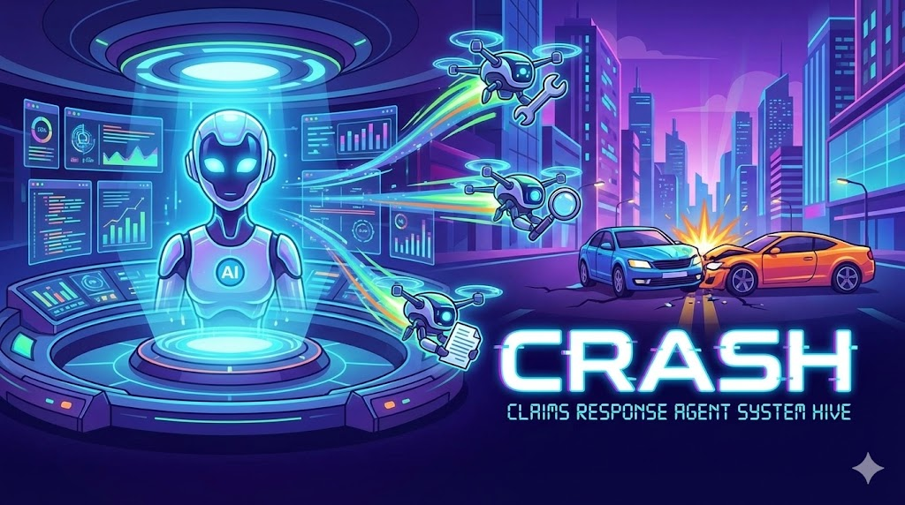
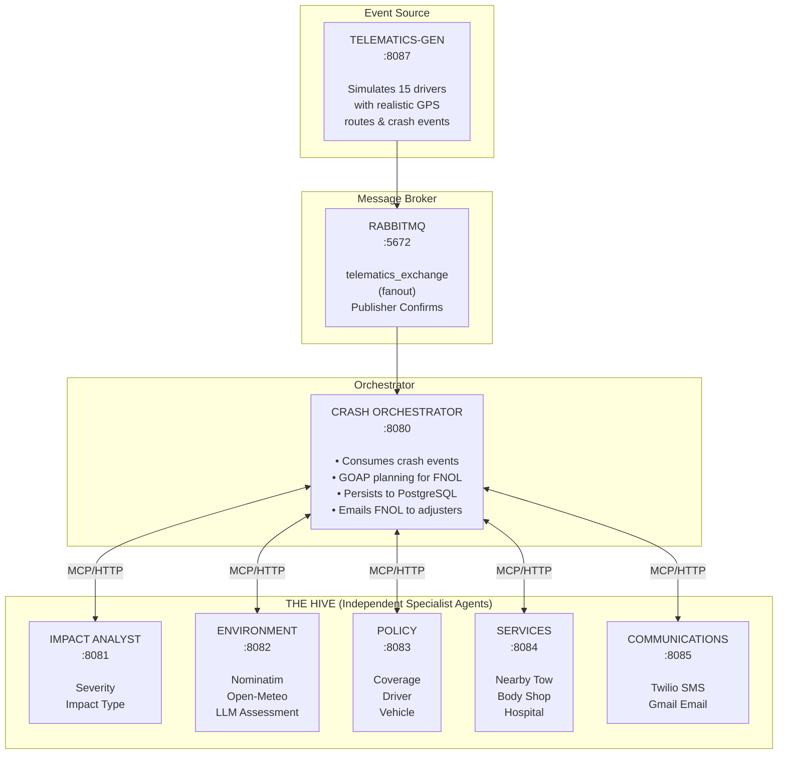
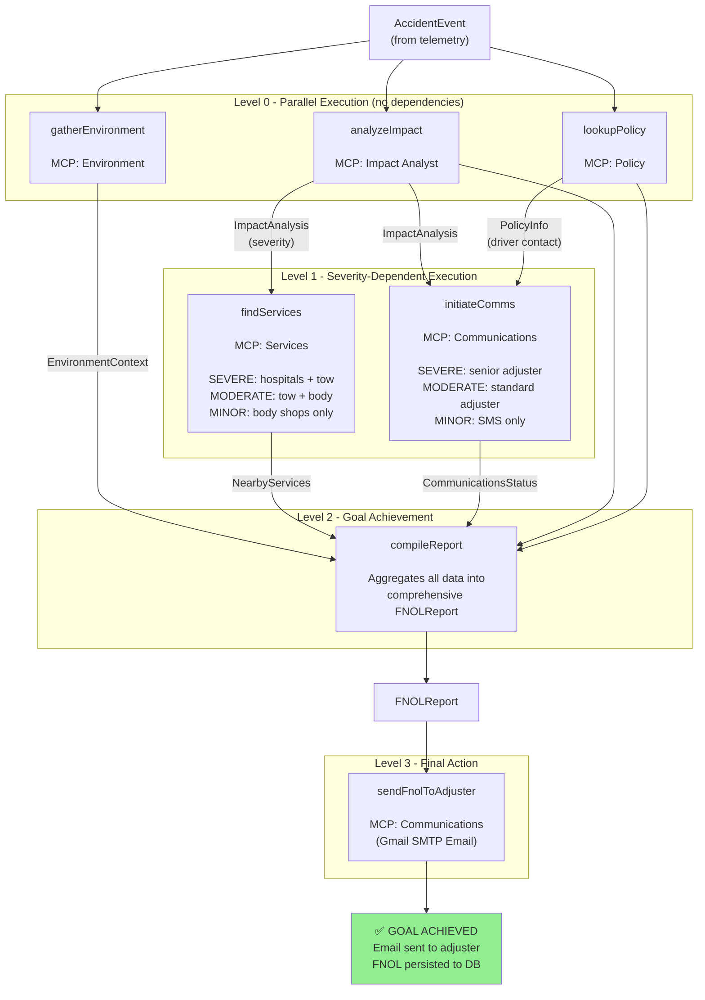

# CRASH - Claims Response Agent System Hive




A multi-agent **First Notice of Loss (FNOL)** system that automatically processes vehicle accident claims using coordinated AI agents working together like a hive.

## What is CRASH?

When a vehicle accident is detected via telemetry (g-force threshold exceeded from a safe driver app), CRASH dynamically orchestrates **5 specialized AI agents** to generate a complete, comprehensive FNOL claim report — automatically.

Each agent is an independent microservice that contributes its expertise:

| Agent | Port | Responsibility | Docs |
|-------|------|----------------|------|
| **Impact Analyst** | 8081 | Analyzes telemetry to classify severity and impact type | [README](crash-mcp-impact-analyst/README.md) |
| **Environment** | 8082 | Gathers weather, road conditions, and location context | [README](crash-mcp-environment/README.md) |
| **Policy** | 8083 | Retrieves insurance coverage, driver profile, and vehicle details | [README](crash-mcp-policy/README.md) |
| **Services** | 8084 | Locates nearby body shops, tow services, hospitals | [README](crash-mcp-services/README.md) |
| **Communications** | 8085 | Handles driver outreach, SMS, email, and adjuster alerts | [README](crash-mcp-communications/README.md) |

## Architecture



**Key Technologies:**
- **Embabel Agent Framework 0.3.2** — Goal-based planning orchestrator using GOAP (full Java support)
- **Spring AI 1.1.2** — Model Context Protocol for agent communication via SSE
- **Spring Boot 3.5.x** — Microservice foundation
- **Google Gemini 2.5 Flash** — Fast LLM for reasoning and planning (via Google AI API)
- **Open-Meteo API** — Real weather data including 24-hour historical analysis
- **OpenStreetMap Nominatim** — Real reverse geocoding for accident location addresses
- **RabbitMQ** — Message broker with publisher confirms for reliable crash event delivery
- **PostgreSQL** — FNOL report persistence

## Quick Start

### Prerequisites

- Java 21+
- Maven 3.9+
- Docker & Docker Compose
- Google AI API Key (Gemini) — get one at https://aistudio.google.com/apikey

### 1. Clone and Build

```bash
git clone <repository-url>
cd imc-crash
mvn clean install
```

### 2. Configure Variables

**Option A: Using vars.yaml (recommended)**
```bash
cp vars.yaml.template vars.yaml
# Edit vars.yaml with your API key and settings
```

**Option B: Environment variable**
```bash
export GOOGLE_API_KEY=AIza...
```

### 3. Start the Hive

**Option A: Using the start script**
```bash
./start.sh --build
```

**Option B: Using Docker Compose**
```bash
mvn clean package -DskipTests
docker-compose up --build
```

**Option C: Manual startup** (6 terminals)
```bash
# Each in a separate terminal:
cd crash-mcp-impact-analyst && mvn spring-boot:run      # :8081
cd crash-mcp-environment && mvn spring-boot:run         # :8082
cd crash-mcp-policy && mvn spring-boot:run              # :8083
cd crash-mcp-services && mvn spring-boot:run            # :8084
cd crash-mcp-communications && mvn spring-boot:run      # :8085
cd crash-orchestrator && mvn spring-boot:run            # :8080
```

### 4. Simulate an Accident

```bash
# Moderate accident
curl -X POST "http://localhost:8080/api/accident/simulate?policyId=200018&gForce=3.8&speedMph=34.5"

# Severe accident
curl -X POST "http://localhost:8080/api/accident/simulate?policyId=200019&gForce=6.2&speedMph=55"

# Minor fender bender
curl -X POST "http://localhost:8080/api/accident/simulate?policyId=200020&gForce=2.8&speedMph=15"
```

## How It Works

1. **Event Trigger** — Safe driver app detects g-force > 2.5 and sends telemetry
2. **Orchestrator Plans** — GOAP planner analyzes dependencies and creates execution plan
3. **Parallel Execution** — Impact, Environment, and Policy agents run simultaneously
4. **Dependent Execution** — Services and Communications wait for required data
5. **Report Compilation** — All results aggregated into comprehensive FNOL report

### GOAP Execution Flow

The system uses Goal-Oriented Action Planning to dynamically determine execution order based on dependencies:



### Severity-Based Behavior

The system adapts its response based on accident severity:

| Severity | Services | Communications |
|----------|----------|----------------|
| **SEVERE** (g-force ≥ 5.0) | Hospitals + tow + body shops + rentals | Senior adjuster notified, roadside dispatched |
| **MODERATE** (g-force ≥ 3.0) | Tow + body shops + rentals | Standard adjuster assigned |
| **MINOR** (g-force < 3.0) | Body shop referrals only | SMS/push notification only |

## Project Structure

```
imc-crash/
├── crash-domain/                   # Shared domain objects (Java Records)
├── crash-orchestrator/             # Central orchestrator + RabbitMQ sink (:8080/:8086)
├── crash-mcp-impact-analyst/       # Impact analysis agent (:8081)
├── crash-mcp-environment/          # Environment context agent (:8082)
├── crash-mcp-policy/               # Policy lookup agent (:8083)
├── crash-mcp-services/             # Services finder agent (:8084)
├── crash-mcp-communications/       # Communications agent (:8085)
├── docker-compose.yml              # Container orchestration (all services)
├── vars.yaml                       # Configuration (API keys, Twilio, Gmail)
├── simulate-accident.sh            # CLI tool for manual accident simulation
└── AGENTIC-ARCHITECTURE.md         # Deep dive into GOAP and agent patterns

../imc-telematics-gen/              # Telematics simulator (sibling project)
├── WebSocket dashboard             # Real-time driver monitoring UI
├── 15 Atlanta drivers              # Realistic GPS routes
└── Crash event generator           # Demo accident triggering
```

## API Reference

### Process Accident Event

```bash
POST /api/accident
Content-Type: application/json

{
  "policyId": 200018,
  "vehicleId": 300021,
  "driverId": 400018,
  "vin": "1HGBH41JXMN109186",
  "eventTime": "2025-01-06T14:47:00Z",
  "speedMph": 34.5,
  "speedLimitMph": 35,
  "gForce": 3.8,
  "latitude": 39.1157,
  "longitude": -77.5636,
  "currentStreet": "Main Street",
  "accelerometerX": -2.1,
  "accelerometerY": 0.3,
  "accelerometerZ": 0.8
}
```

### Simulation Endpoint

```bash
POST /api/accident/simulate?policyId={id}&gForce={value}&speedMph={value}
```

### Health Check

```bash
GET /api/health                    # Orchestrator
GET http://localhost:8081/actuator/health  # Impact Analyst
# ... etc for ports 8082-8085
```

## Test Policies

Three pre-configured policies are available for testing:

| Policy ID | Description |
|-----------|-------------|
| `200018` | Standard policy |
| `200019` | Premium policy |
| `200020` | Basic policy |

## Documentation

For detailed information, see:
- [BUILD.md](BUILD.md) — Comprehensive build guide, configuration reference, and extension instructions
- [AGENTIC-ARCHITECTURE.md](AGENTIC-ARCHITECTURE.md) — Deep dive into GOAP planning and agent patterns

### Agent Documentation
Each agent has its own README with detailed tool documentation:
- [Impact Analyst](crash-mcp-impact-analyst/README.md) — Severity classification, impact type detection, accelerometer analysis
- [Environment](crash-mcp-environment/README.md) — Weather APIs, LLM-based road assessment, geocoding
- [Policy](crash-mcp-policy/README.md) — Policy lookup, driver profiles, vehicle details
- [Services](crash-mcp-services/README.md) — Nearby service location, severity-based recommendations
- [Communications](crash-mcp-communications/README.md) — Twilio SMS, Gmail SMTP, adjuster notifications

## Extending CRASH

### Add a New Tool

```java
@Tool(description = "Estimate vehicle repair cost")
public RepairEstimate estimateRepairCost(
    @ToolParam(description = "Severity level") String severity,
    @ToolParam(description = "Vehicle make") String make
) {
    // Implementation - automatically exposed via MCP
}
```

### Add a New Agent

1. Create module: `crash-mcp-<name>`
2. Implement tools with `@Tool` annotations
3. Add MCP client connection to orchestrator
4. Create orchestrator actions that use the new tools

## Recent Enhancements

- **Google Gemini 2.5 Flash** — Fast, reliable LLM for agent reasoning and tool orchestration
- **Real Reverse Geocoding** — OpenStreetMap Nominatim API provides actual street addresses from GPS coordinates, with 30+ road type classifications (Interstate, Highway, Arterial, Residential, etc.)
- **Publisher Confirms with Retry** — Critical crash events use RabbitMQ publisher confirms with 3x retry logic and exponential backoff to ensure no messages are lost
- **Telematics Generator Integration** — Full simulation of 15 drivers on realistic Atlanta routes with real-time crash event generation via WebSocket dashboard
- **24-Hour Weather History** — Environment agent analyzes weather conditions for the 24 hours prior to the accident, detecting significant events like heavy precipitation, snow, freeze/thaw cycles, and thunderstorms
- **Complete FNOL Email Reports** — Automatically emails comprehensive claim reports to adjusters via Gmail SMTP, including weather, environment, services, and recommended actions
- **SMS Notifications** — Twilio integration for driver wellness checks and status updates
- **PostgreSQL Persistence** — FNOL reports persisted with full audit trail
- **Enhanced Impact Classification** — Improved detection of ROLLOVER, SIDE, REAR, and FRONTAL impacts using accelerometer data

## Future Enhancements

- Real-time claims dashboard UI
- Fraud detection agent
- Fleet manager agent
- Kubernetes deployment
- Integration with real SMS/notification services

## License

Apache 2.0

---

*CRASH - Claims Response Agent System Hive*
*A multi-agent FNOL demonstration by Insurance Mega Corp*
