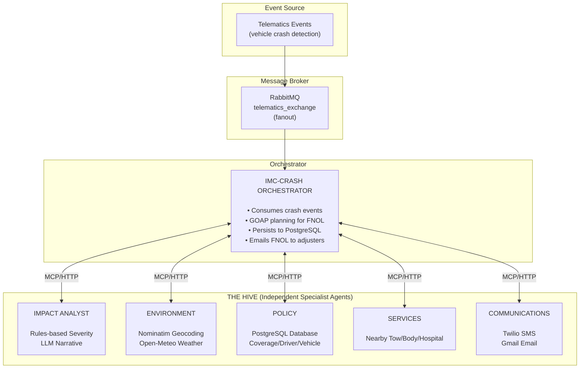
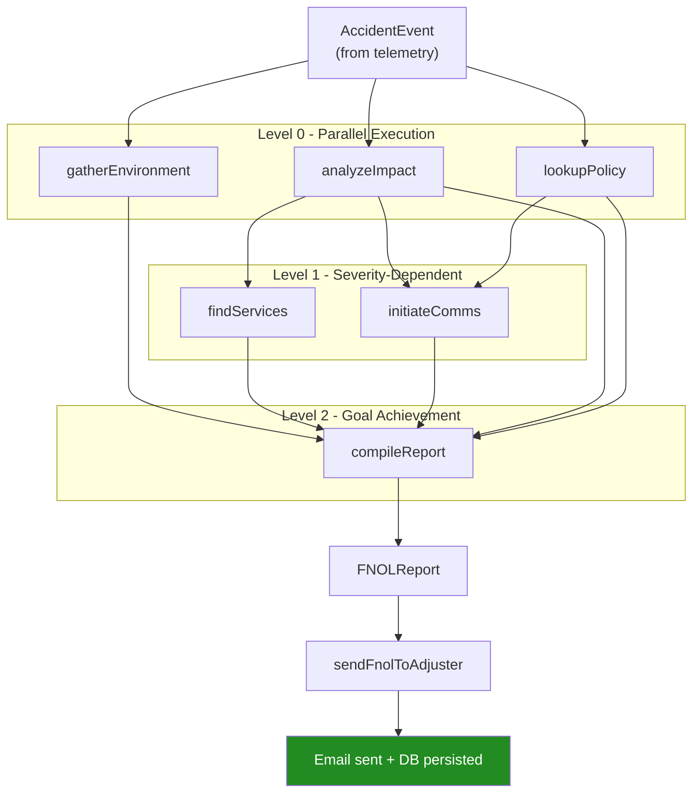

# IMC-CRASH - Claims Response Agent System Hive


A multi-agent **First Notice of Loss (FNOL)** system that automatically processes vehicle accident claims using coordinated AI agents working together like a hive.

## What is IMC-CRASH?

When a vehicle accident is detected via telemetry (g-force threshold exceeded from a safe driver app), IMC-CRASH dynamically orchestrates **5 specialized AI agents** to generate a complete, comprehensive FNOL claim report — automatically.

Each agent is an independent microservice that contributes its expertise:

| Agent | Responsibility | Details |
|-------|----------------|---------|
| **Impact Analyst** | Analyzes telemetry to classify severity and impact type | Rules-based classification + LLM narrative |
| **Environment** | Gathers weather, road conditions, and location context | Real APIs (Nominatim, Open-Meteo) |
| **Policy** | Retrieves insurance coverage, driver profile, and vehicle details | PostgreSQL database |
| **Services** | Locates nearby body shops, tow services, hospitals | Severity-based recommendations |
| **Communications** | Handles driver outreach, SMS, email, and adjuster alerts | Twilio SMS, Gmail SMTP |

## Architecture



## Key Technologies

- **Embabel Agent Framework** — Goal-based planning orchestrator using GOAP
- **Spring AI** — Model Context Protocol (MCP) for agent communication
- **Spring Boot 3.5.x** — Microservice foundation
- **Google Gemini** — LLM for reasoning, planning, and narrative generation
- **Open-Meteo API** — Real weather data including 24-hour historical analysis
- **OpenStreetMap Nominatim** — Real reverse geocoding for accident location addresses
- **Twilio** — SMS notifications to drivers
- **Gmail SMTP** — FNOL email reports to adjusters
- **RabbitMQ** — Message broker with publisher confirms
- **PostgreSQL** — Policy data storage and FNOL report persistence

## How It Works

1. **Event Trigger** — Safe driver app detects g-force > 2.5 and sends telemetry
2. **Orchestrator Plans** — GOAP planner analyzes dependencies and creates execution plan
3. **Parallel Execution** — Impact, Environment, and Policy agents run simultaneously
4. **Dependent Execution** — Services and Communications wait for required data
5. **Report Compilation** — All results aggregated into comprehensive FNOL report
6. **Notifications** — SMS to driver, email to adjuster, report persisted to database

### GOAP Execution Flow



### Severity-Based Behavior

| Severity | Criteria | Services | Communications |
|----------|----------|----------|----------------|
| **SEVERE** | g-force ≥ 5.0 | Hospitals + tow + body shops | Senior adjuster, roadside dispatch |
| **MODERATE** | g-force ≥ 3.0 | Tow + body shops + rentals | Standard adjuster assigned |
| **MINOR** | g-force < 3.0 | Body shop referrals only | SMS notification only |

## Real vs Simulated Services

| Component | Service | Status | Details |
|-----------|---------|--------|---------|
| **Environment** | Reverse Geocoding | **REAL** | OpenStreetMap Nominatim API |
| **Environment** | Weather | **REAL** | Open-Meteo API + 24hr history |
| **Communications** | SMS | **REAL** | Twilio SDK |
| **Communications** | Email | **REAL** | Gmail SMTP |
| **Policy** | Policy/Driver/Vehicle | **REAL** | PostgreSQL database |
| **Impact Analyst** | Severity Classification | Rules-based | Threshold algorithm |
| **Impact Analyst** | Narrative Generation | **REAL** | LLM-generated |
| **Services** | Body Shops/Tow/Hospitals | Simulated | Mock data |
| **Orchestrator** | GOAP Planning | **REAL** | Embabel Agent Framework |
| **Orchestrator** | LLM Reasoning | **REAL** | Google Gemini |

## Deployment Options

| Environment | Documentation | Status |
|-------------|---------------|--------|
| **Local Development** | [LOCAL-DEVELOPMENT.md](LOCAL-DEVELOPMENT.md) | Available |
| **Cloud Foundry** | [CLOUD-FOUNDRY.md](CLOUD-FOUNDRY.md) | Planned |

## Project Structure

```
imc-crash/
├── crash-domain/                   # Shared domain objects (Java Records)
├── crash-orchestrator/             # Central orchestrator + RabbitMQ sink
├── crash-mcp-impact-analyst/       # Impact analysis agent
├── crash-mcp-environment/          # Environment context agent
├── crash-mcp-policy/               # Policy lookup agent
├── crash-mcp-services/             # Services finder agent
├── crash-mcp-communications/       # Communications agent
├── db/                             # Database schema and setup scripts
├── docker-compose.yml              # Container orchestration
├── vars.yaml.template              # Configuration template
└── docs/
    ├── LOCAL-DEVELOPMENT.md        # Local setup guide
    ├── CLOUD-FOUNDRY.md            # CF deployment guide
    ├── BUILD.md                    # Build and extension guide
    └── AGENTIC-ARCHITECTURE.md     # GOAP and agent patterns
```

## Documentation

| Document | Description |
|----------|-------------|
| [LOCAL-DEVELOPMENT.md](LOCAL-DEVELOPMENT.md) | Complete local setup with Docker Compose |
| [CLOUD-FOUNDRY.md](CLOUD-FOUNDRY.md) | Cloud Foundry deployment guide |
| [BUILD.md](BUILD.md) | Build guide, configuration reference, extending the system |
| [AGENTIC-ARCHITECTURE.md](AGENTIC-ARCHITECTURE.md) | Deep dive into GOAP planning and agent patterns |

### Agent Documentation

Each agent has its own README with detailed tool documentation:

- [Impact Analyst](crash-mcp-impact-analyst/README.md) — Severity classification, impact type detection
- [Environment](crash-mcp-environment/README.md) — Weather APIs, road assessment, geocoding
- [Policy](crash-mcp-policy/README.md) — Database-backed policy lookup
- [Services](crash-mcp-services/README.md) — Nearby service location
- [Communications](crash-mcp-communications/README.md) — Twilio SMS, Gmail SMTP

## API Reference

### Process Accident Event

```bash
POST /api/accident
Content-Type: application/json

{
  "policyId": 200001,
  "vehicleId": 300001,
  "driverId": 400001,
  "vin": "1G1RC6E45F0123451",
  "eventTime": "2025-01-06T14:47:00Z",
  "speedMph": 34.5,
  "speedLimitMph": 35,
  "gForce": 3.8,
  "latitude": 33.7490,
  "longitude": -84.3880,
  "currentStreet": "Peachtree Street",
  "accelerometerX": -2.1,
  "accelerometerY": 0.3,
  "accelerometerZ": 0.8
}
```

### Simulation Endpoint

```bash
POST /api/accident/simulate?policyId={id}&gForce={value}&speedMph={value}
```

## License

Apache 2.0

---

*IMC-CRASH - Claims Response Agent System Hive*
*A multi-agent FNOL system by Insurance Mega Corp*
